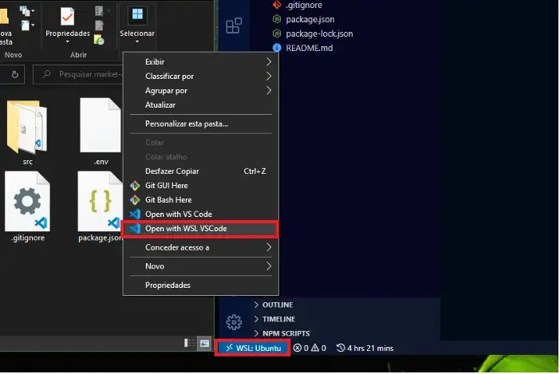

<a name="TOC"></a>

<h1 align="center">How to add “Open with WSL VS Code” to Windows Context Menu</h1>

<div align="center"></div>

# Introduction

The ability to choose in which VS Code we want to open a certain folder is not displayed in the windows context menu as default, so we have two main options:

- Open the Linux subsystem terminal and send the command to open;
- Open the Windows VS Code and choose its WSL edition to open the current open project.

None of these options was good enough for me, so I decided to write a simple tool to add display the WSL VS Code option.

---

# Requirements

In order to complete this tutorial effectively, you should have:
- Installed Ubuntu subsystem for Windows
- Installed WSL extension for VS Code

---

## Open with WSL VS Code script

In order to do that effectvly I tryid both .REG and .BAT files, bot they diding work very well, the first didnt run function (which are necessery in order to convert windows path location to an string understandble by linux) and the last was showing an window everytime an folder was opend by WSL VS Code.

So I ended up using a .VBS, as it follows:

```vbnet
Dim userprofile
Dim vscodeLocation
Dim wls_args

Dim objfso
Dim objShell

Dim originalFolder
Dim folderDrive
Dim formatedFolder
Dim commandToRun

Set objfso = CreateObject("Scripting.FileSystemObject")
Set objShell = CreateObject("WScript.Shell")

userprofile = objShell.ExpandEnvironmentStrings("%USERPROFILE%")
vscodeLocation= userprofile & "\AppData\Local\Programs\Microsoft VS Code\Code.exe"
wls_args = "--remote wsl+Ubuntu"

if (WScript.Arguments.Count = 0) then
  msgbox "No folder was selected!"
  WScript.Quit
end if

if Not (objfso.FolderExists(WScript.Arguments(0))) then
  msgbox "Folder was not found!"
  WScript.Quit
end if

originalFolder = WScript.Arguments(0)
folderDrive = objfso.GetDriveName(originalFolder)
formatedFolder = Replace(originalFolder, folderDrive, Lcase(folderDrive))
formatedFolder = Replace(formatedFolder, "\","/")
formatedFolder = Replace(formatedFolder, ":","")
formatedFolder = "mnt/" & formatedFolder

commandToRun = Chr(34) & vscodeLocation & Chr(34) & " " & wls_args & " " & Chr(34) & formatedFolder & Chr(34)
'  Wscript.Echo commandToRun
objShell.Run commandToRun, 0

Set objfso = Nothing
Set objShell = Nothing
```

You don't have much to do in the code, except **checking if your VS Code is installed locally (only your user) or for all users**. In the last case, you have to replace the following line with the exact VS Code location:

```vbnet
vscodeLocation = userprofile & "\AppData\Local\Programs\Microsoft VS Code\Code.exe"
```

After that, open the notepad, paste the code and save it as `"open in WSL VS Code.vbs"`. Then, place it in a folder that you now its not goning to be deleted acidentaly, for example, I saved mine in `C:\scripts\open in WSL VS Code.VBS`.

This script already open an placed folder with the WSL VS Code, but thats not quit what we want.

---

## Add Open with WSL VS Code to context menu script

So we need one more script to add this functionality to the context window. To do that, save the following script as `add_to_registry.bat`.

```batch
@echo off
color 04
title Add Open With WSL VS Code to Context Window Options

set "scriptLocation=C:\scripts\open In WSL VSCode.vbs"
set "VscoIcon=C:\Users\lucas\AppData\Local\Programs\Microsoft VS Code\Code.exe"
set "registryKeyName=WSL VSCode"
set "ContextMenuCommandName=Open with WSL VS Code"

set "OpenSpecifiedFolderKey=HKCR\Directory\shell\%registryKeyName%"
set "OpenSpecifiedFolderKeyValue= "\"%windir%\system32\wscript.exe\" \"%scriptLocation%\" "\"%%1\""

REG ADD "%OpenSpecifiedFolderKey%" /v "Icon" /t REG_EXPAND_SZ /d "%VscoIcon%"
REG ADD "%OpenSpecifiedFolderKey%" /ve /t REG_EXPAND_SZ /d "%ContextMenuCommandName%"
REG ADD "%OpenSpecifiedFolderKey%\command" /ve /t REG_EXPAND_SZ /d %OpenSpecifiedFolderKeyValue%

set "OpenCurrentFolderKey=HKCR\Directory\Background\shell\%registryKeyName%"
set "OpenCurrentFolderKeyValue= "\"%windir%\system32\wscript.exe\" \"%scriptLocation%\" "\"%%V\""

REG ADD "%OpenCurrentFolderKey%" /v "Icon" /t REG_EXPAND_SZ /d "%VscoIcon%"
REG ADD "%OpenCurrentFolderKey%" /ve /t REG_EXPAND_SZ /d "%ContextMenuCommandName%"
REG ADD "%OpenCurrentFolderKey%\command" /ve /t REG_EXPAND_SZ /d %OpenCurrentFolderKeyValue%

pause>nul
exit /b
```

The only thing you should change in the above script is the `open in WSL VS Code script` and the Windows VS Code paths, as it is shown:

```batch
set "scriptLocation=C:\scripts\open In WSL VSCode.vbs"
set "VscoIcon=C:\Users\lucas\AppData\Local\Programs\Microsoft VS Code\Code.exe"
```

After you place the correct paths, make sure to **run it as Administrator**. Then, you should see a screen telling you that the keys were successfull added to registry and if you click the right button inside or on a folder, you should see the brand new option.

<div align="center"><a href="#"></a></div>
<br>

<div align="center">
  <p>Made with ❤️ by Lucas Vieira.</p>
  <p>👉 go back to all <a href="../../README.md#TOC">my articles</a></p>
  <p>👉 See also all <a href="https://github.com/lucasvtiradentes/lucasvtiradentes/blob/master/portfolio/PROJECTS.md#TOC">my projects</a></p>
  <p>👉 See also <a href="https://github.com/lucasvtiradentes/lucasvtiradentes/blob/master/portfolio/WORK_EXPERIENCE.md#TOC">my work experience</a></p>
</div>
