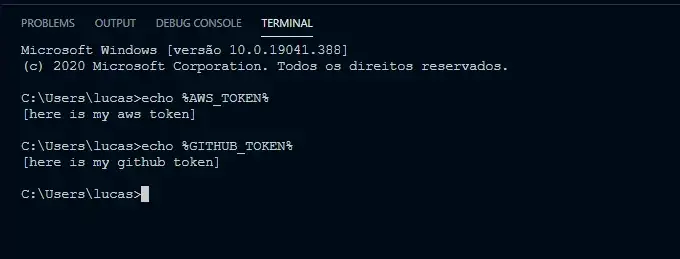

<a name="TOC"></a>

<h1 align="center">How to add a .bashrc equivalent to the windows cmd terminal</h1>

<div align="center"></div>

# Introduction

In *nix operation systems there is a file, called .bashrc, which is loaded before the bash terminal is ready to use, so you can use all the variables setted in that file. It is really useful as you can create personal macros and aliases to boost you productivity.

If you want to to do the same thing in the Windows Command Prompt (CMD), you have to do these steps:

## Create a .bat with the variables you want

This file should be saved in a place it is not going to be deleted accidently, for example, you could create a folder in C:\scripts` and save it there.

The file should look like this:

```batch
@echo off
set GITHUB_TOKEN=[here is my github token]
set AWS_TOKEN=[here is my aws token]
```

## Add the file to be loaded before cmd init

In order to do that you have to add a registry key specifying the path of the cmdrc, as it is shown bellow:

```batch
@echo off
color 04
title Add cmd rc to registry

set "OpenCurrentFolderKey=HKLM\SOFTWARE\Microsoft\Command Processor"
set "cmdRcPath=C:\scripts\cmd rc.bat"
REG ADD "%OpenCurrentFolderKey%" /v "AutoRun" /t REG_EXPAND_SZ /d "\"%cmdRcPath%\""

pause>nul
exit /b
```

Save the file also with a .bat extension and make sure to run it as admin. After that you should be able to retrieve all your variables whenever the Command Prompt is open 🚀.

<div align="center"><a href="#"></a></div>
<br>

<div align="center">
  <p>Made with ❤️ by Lucas Vieira.</p>
  <p>👉 go back to all <a href="../../README.md#TOC">my articles</a></p>
  <p>👉 See also all <a href="https://github.com/lucasvtiradentes/lucasvtiradentes/blob/master/portfolio/PROJECTS.md#TOC">my projects</a></p>
  <p>👉 See also <a href="https://github.com/lucasvtiradentes/lucasvtiradentes/blob/master/portfolio/WORK_EXPERIENCE.md#TOC">my work experience</a></p>
</div>
