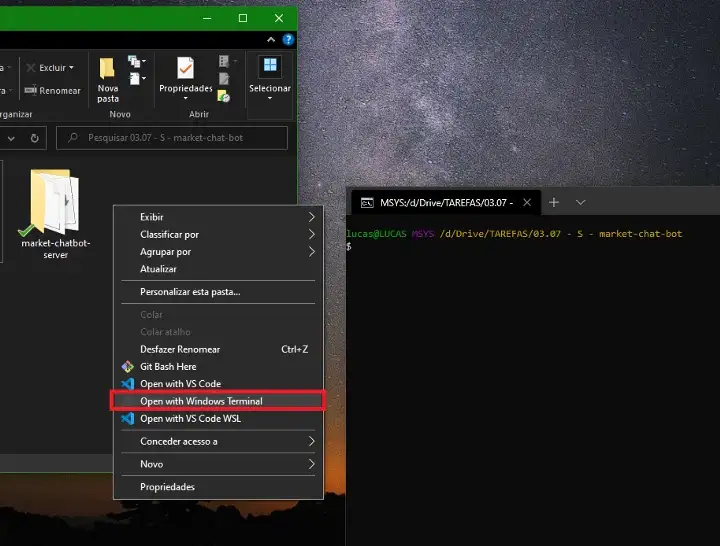

<a name="TOC"></a>

<h1 align="center">How to add “Open with Windows Terminal” option to the context menu</h1>

<div align="center"></div>

# Introduction

The new Windows Terminal doesn’t come with the option to be open with the right click menu by default, so you can either:

- open the terminal and navigate to the folder you want;
- type wt in the current folder’s path.

Personaly, I prefere open it with the context menu, so I add this functionality myself. In order to do that, you have to do the following steps.

---

## Save a file to open the windows terminal

```vbnet
' open with Windows Terminal.vbs
Dim objShell
Dim folderToOpen
Set objShell = WScript.CreateObject("WScript.Shell")

If (WScript.Arguments.Count = 0) Then

  objShell.Run ("wt -d .")

else

  If (Len(WScript.Arguments(0)) = 3) Then
    folderToOpen = Replace(WScript.Arguments(0), "\", "")
  Else
    folderToOpen = WScript.Arguments(0)
  End If

  objShell.Run ("wt -d " & Chr(34) & folderToOpen & Chr(34))

End If
```

Make sure to save it in a place you know it is not going to be deleted accidentaly. By clicking in the above file, or draging a folder to it, you can easily open the Windows terminal. But thats not good enough, so we need to run it with the right click menu with the following script.

---

### Add the script to the context menu

```batch
:: add Run Windows Terminal to Registry.bat
@echo off
color 04
title Add Open With Windows Terminal to Context Window Options

set "scriptLocation=C:\scripts\open with Windows Terminal.vbs"
set "windowsTerminalIcon=C:\scripts\windows_terminal_LVz_icon.ico"
set "registryKeyName=Windows Terminal"
set "ContextMenuCommandName=Open with Windows Terminal"

set "OpenSpecifiedFolderKey=HKCR\Directory\shell\%registryKeyName%"
set "OpenSpecifiedFolderKeyValue= "\"%windir%\system32\wscript.exe\" \"%scriptLocation%\" "\"%%1\""

REG ADD "%OpenSpecifiedFolderKey%" /v "Icon" /t REG_EXPAND_SZ /d "%windowsTerminalIcon%"
REG ADD "%OpenSpecifiedFolderKey%" /ve /t REG_EXPAND_SZ /d "%ContextMenuCommandName%"
REG ADD "%OpenSpecifiedFolderKey%\command" /ve /t REG_EXPAND_SZ /d %OpenSpecifiedFolderKeyValue%

set "OpenCurrentFolderKey=HKCR\Directory\Background\shell\%registryKeyName%"
set "OpenCurrentFolderKeyValue= "\"%windir%\system32\wscript.exe\" \"%scriptLocation%\" "\"%%V\""

REG ADD "%OpenCurrentFolderKey%" /v "Icon" /t REG_EXPAND_SZ /d "%windowsTerminalIcon%"
REG ADD "%OpenCurrentFolderKey%" /ve /t REG_EXPAND_SZ /d "%ContextMenuCommandName%"
REG ADD "%OpenCurrentFolderKey%\command" /ve /t REG_EXPAND_SZ /d %OpenCurrentFolderKeyValue%

pause>nul
exit /b
```

The only thing you need to change in the above script is the first script path and also the path of the icon to show in the terminal context menu option. Make sure to convert it to .ico file or it will not work.

After run this script with admin rights, you should see the brand new option to open a folder or the current one with the Windows Terminal 🤘.

<div align="center"><a href="#"></a></div>
<br>

<div align="center">
  <p>Made with ❤️ by Lucas Vieira.</p>
  <p>👉 go back to all <a href="../../README.md#TOC">my articles</a></p>
  <p>👉 See also all <a href="https://github.com/lucasvtiradentes/lucasvtiradentes/blob/master/portfolio/PROJECTS.md#TOC">my projects</a></p>
  <p>👉 See also <a href="https://github.com/lucasvtiradentes/lucasvtiradentes/blob/master/portfolio/WORK_EXPERIENCE.md#TOC">my work experience</a></p>
</div>
