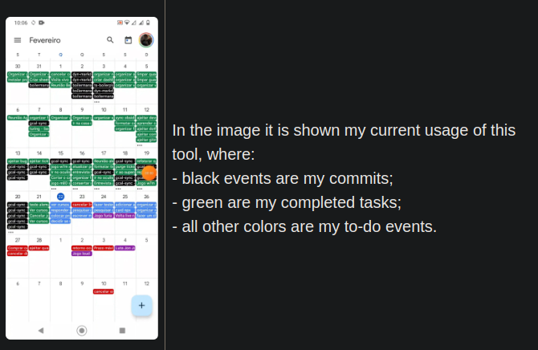

<h1>Add an one way sync from ticktick and github to google calendar</h1>

> What if you could track your overall progress effortless in google calendar?

## Why

We as developers often experience a sense of working all the time and still feeling like we are not accomplishing enough.

## Solution

To combat this feeling I decided to track my progress from both ticktick and also github, the platforms I use the most.

So I developed a npm package, called <a href="https://github.com/lucasvtiradentes/gcal-sync#readme">gcal-sync</a>, which basically adds a one way sync between ticktick and github to google calendar.

## Requirements

The only thing you need to use this solution is a `gmail/google account`.

## Usage

To effectively use this project, please head to the main [project instructions](https://github.com/lucasvtiradentes/gcal-sync/blob/master/README.md#installation).

## Final words

This project was really helped me to track my progress and makes me feel good about the hard work I put on in a daily basis.

 

## Related

👉 If you want to check the repository source code, it is [here](https://github.com/lucasvtiradentes/gcal-sync/)
👉 See also all [my projects](https://github.com/lucasvtiradentes/lucasvtiradentes/blob/master/portfolio/PROJECTS.md#TOC)
👉 See also all [my tutorials](https://github.com/lucasvtiradentes/my-tutorials/blob/master/README.md#TOC)
