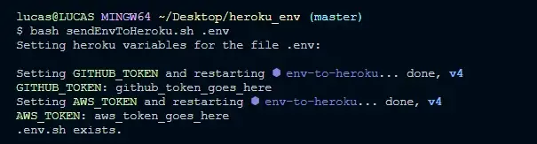
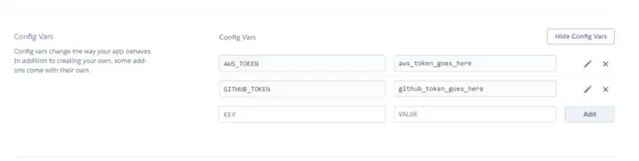

<a name="TOC"></a>

<h1 align="center">How to set .env variables to Heroku dynamically with a .sh script</h1>

<div align="center"></div>

# Introduction

One of the things I really missed when I started using .env files to securelly store important variables, instead of just putting it in the source code, was the abillity to push them to my remote effectivelly.

---

## Code to send .env variables to heroku

After some reasearch, I didn’t found anything related so I decide to code it myself. And here is the result:

```bash
#!/bin/bash
# USAGE: bash addEnvToHeroku.sh <filepath>

# SET VARIABLES ________________________________________________________________
input=$1
output=$1.sh

# DEFINE FUNCTION TO DELETE FILE _______________________________________________
function deleteIfExist {
   if test -f "$1"; then
      echo "$1 exists."
      unlink "$1"
   fi
}

# SHOW SCRIPT TITLE ____________________________________________________________
echo -e "Setting heroku variables for the file $input: \n"

# DELETE THE SH FILE IF IT EXISTS ______________________________________________
deleteIfExist "$output"

# READ THE CONTENT AND SAVE IN A SH FILE _______________________________________
while read -r line; do
   echo "heroku config:set $line" >> "$output"
done < "$input"

# EXECUTE THE SH FILE __________________________________________________________
bash "$output"

# DELETE THE SH FILE IF IT EXISTS ______________________________________________
deleteIfExist "$output"
```
---

## Configuration if you’re using Windows

As you can see, it is a .sh file, but you can run it in Windows as well, you just need to specify the git bash location in your .bashrc file, which is located in C:\user\[your user name]\.bashrc , as it is show bellow:

```bash
alias bash='"C:\\Program Files\\Git\\bin\\bash.exe'
```

---

## How to use

Now let’s see a simple example on how to use the script.

```bash
# Create a project folder
mkdir MySimplepProject

# Go to the project path
cd MySimpleProject

# Initialize git
git init

# Select your heroku app
heroku git:remote -a mySimpleProjectInHeroku

# supposing you have a ".env" and "addEnvToHeroku.sh" in the project root

# Send the .env variables to heroku
bash addEnvToHeroku.sh ".env"
```

And if you go to heroku you should see all your .env variables:

<div align="center"></div>

Now you can change and update these variables quicker and easier! 🤘

<div align="center"><a href="#"></a></div>
<br>

<div align="center">
  <p>Made with ❤️ by Lucas Vieira.</p>
  <p>👉 go back to all <a href="../../README.md#TOC">my articles</a></p>
  <p>👉 See also all <a href="https://github.com/lucasvtiradentes/lucasvtiradentes/blob/master/portfolio/PROJECTS.md#TOC">my projects</a></p>
  <p>👉 See also <a href="https://github.com/lucasvtiradentes/lucasvtiradentes/blob/master/portfolio/WORK_EXPERIENCE.md#TOC">my work experience</a></p>
</div>
